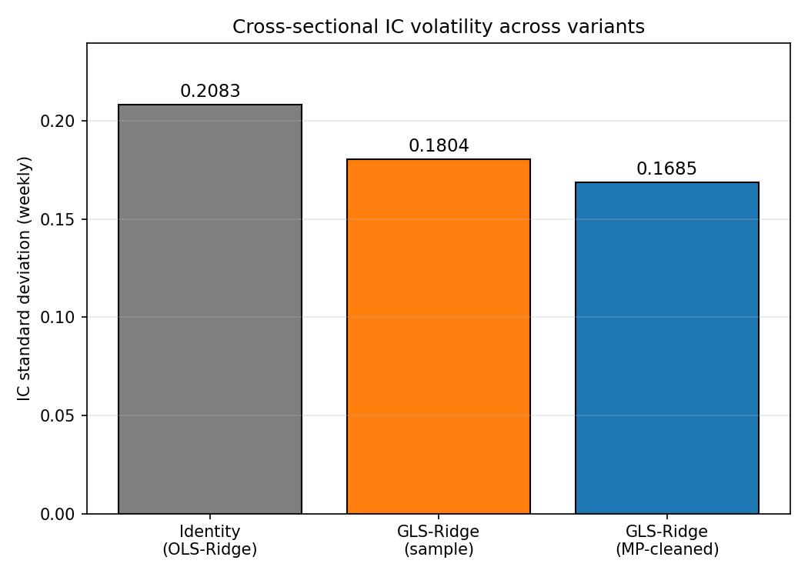
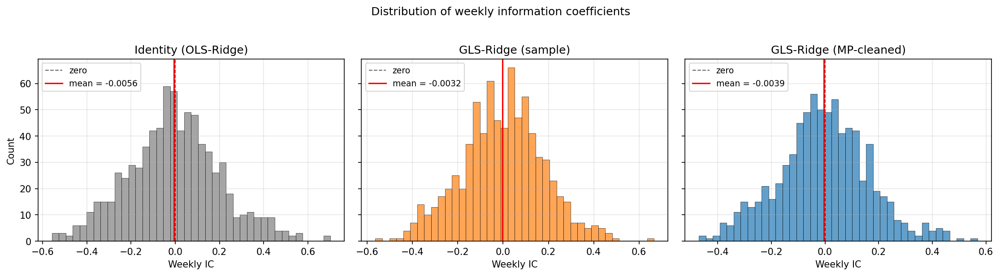
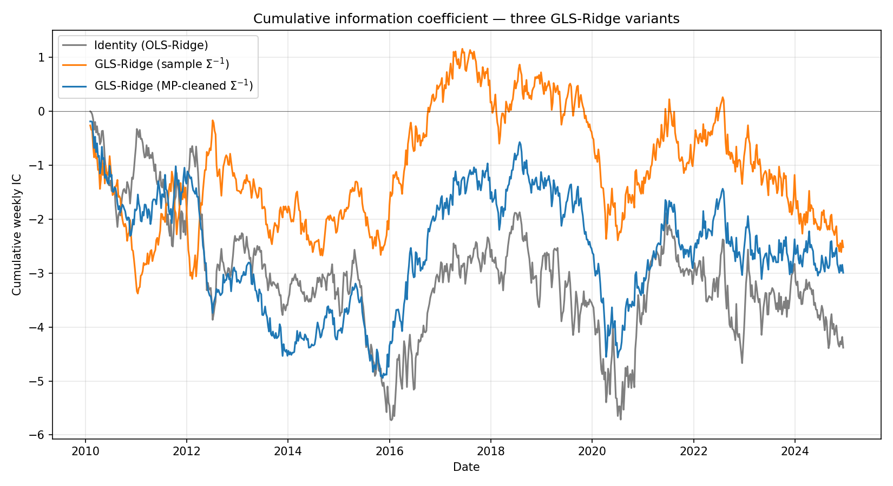
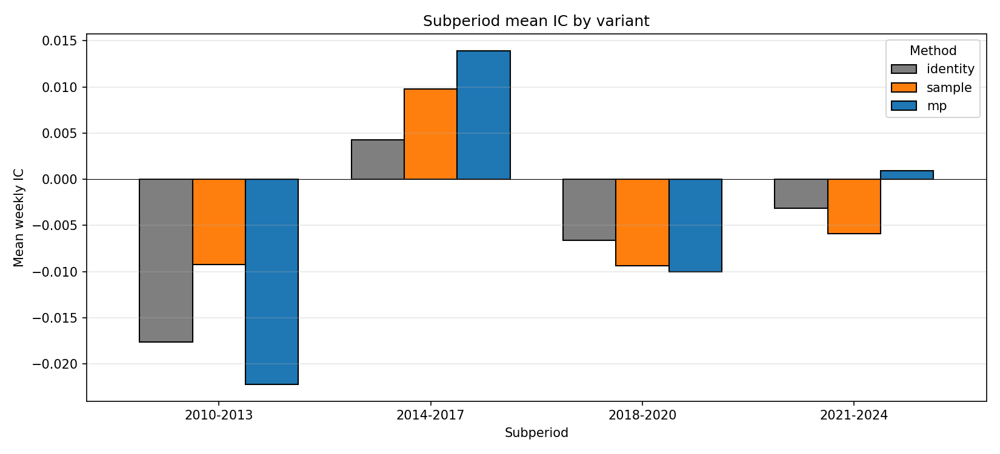
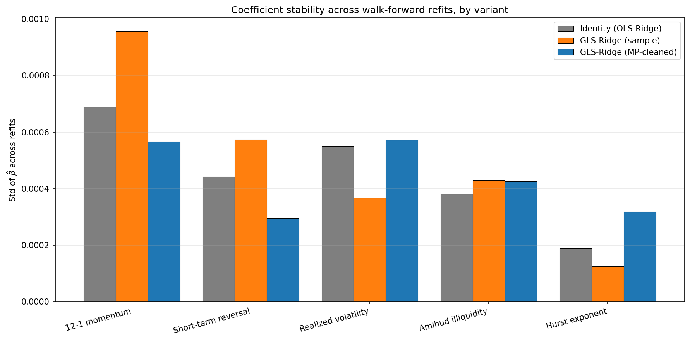
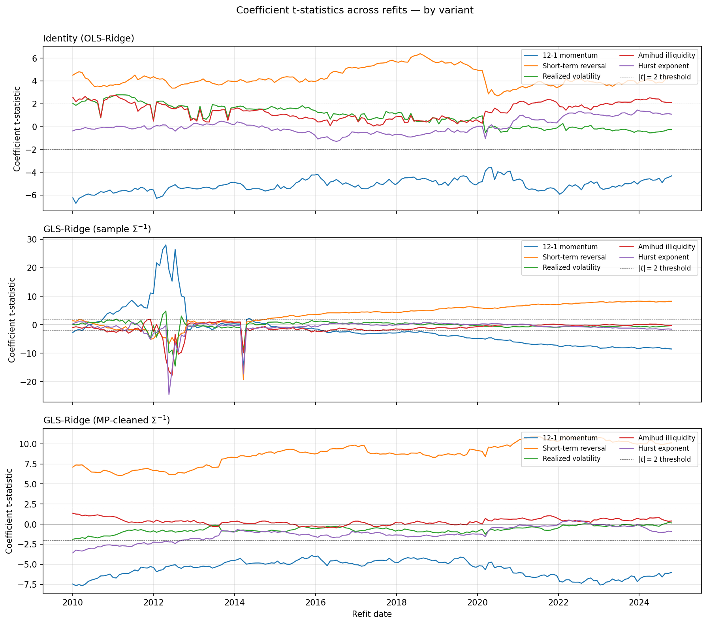
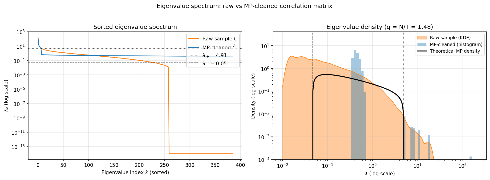
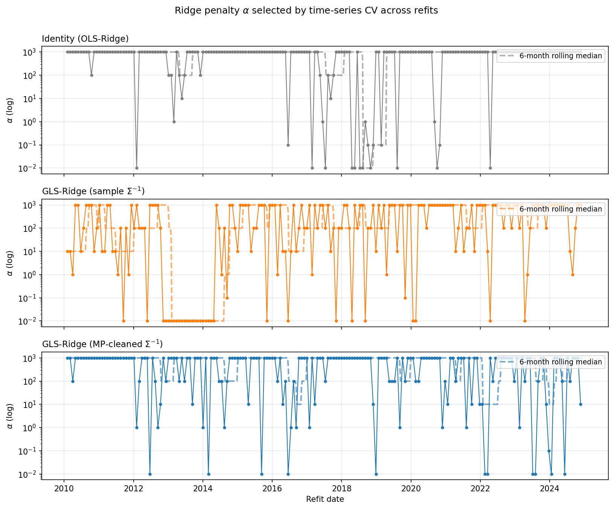
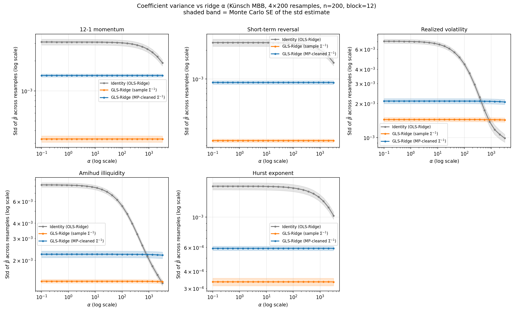
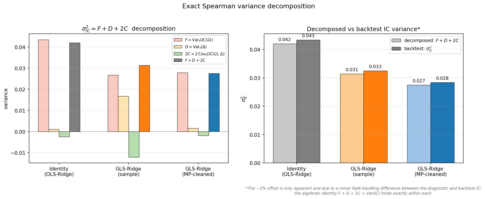

# Spectral Alpha

A cross-sectional alpha research project implementing **pooled GLS-Ridge regression with Marchenko-Pastur cleaned covariance** for weekly equity return prediction in the S&P 500.

 Our main result is that GLS with the covariance matrix obtained from a trace-preserving Marchenko-Pastur filter applied to the sample correlations of S&P 500 returns produces a 35% variance reduction of the Spearman Information Coefficient relative to OLS, and approximately a 12% reduction relative to GLS with the raw sample covariance matrix, together with an overall improvement in the stability of the estimator. 

This project bridges Random Matrix Theory with quantitative equity research, providing a rigorous empirical test of inverse-covariance weighting under realistic walk-forward conditions on a 15-year out-of-sample window (2010-2024).

---

## Abstract
Pooled cross-sectional regressions for returns prediction face a well-known difficulty: financial returns are non-Gaussian and cross-sectionally correlated. This last feature invalidates the i.i.d assumption under which OLS is efficient. When errors are not i.i.d but their true covariance $`\Sigma=\mathrm{Cov}(\epsilon)`$ is known, the Gauss-Markov-Aitken theorem guarantees that GLS with weighting matrix $`W=\Sigma^{-1}`$ is the minimum-variance linear unbiased estimator (BLUE). However in practice $`\Sigma`$ is unknown, and the natural plug-in is the sample covariance matrix $`\hat{\Sigma}\in\mathbb{R}^{N\times N}`$, with entries

$$
\hat{\Sigma}_{ij}:=\frac{1}{T-1}\sum_{t=1}^T(r_{t,i}-\bar{r}_{i})(r_{t,j}-\bar{r}_j),
$$

where $`N`$ is the number of assets,  $`T`$ is the training window length,  $`r_{t,i}`$ is the residual of asset $`i`$ at week $`t`$ and $`\bar{r}_{i}`$ is its  training-window mean. However, $`\hat{\Sigma}`$ contains noise in its spectrum, which propagates into the GLS weighting and corrupts the estimator. Moreover, as it will be our case, $`\hat{\Sigma}`$ can also be rank-deficient if $`N>T`$ for some training window, which means that it only admits a Moore-Penrose  pseudo-inverse $`\hat{\Sigma}^{+}`$; the small non-zero eigenvalues of $`\hat{\Sigma}`$ invert to enormous values that dominate $`W=\hat{\Sigma}^+`$ and further destabilise the estimator. 

According to the Marchenko-Pastur (MP) theorem from Random Matrix Theory, in the Kolmogorov limit $`N,T\rightarrow \infty`$ with $`q:=N/T`$ held fixed,  the eigenvalues of the sample correlation matrix $`\hat{C}`$ built from  i.i.d random noise with zero mean and unit variance are supported on the bulk $`\mathcal{B}:=\lbrace\lambda:\lambda\in[\lambda_-,\lambda_+]\rbrace`$, $`\lambda_{\pm}:=(1\pm\sqrt{q})^2`$, plus a Dirac-delta contribution at zero when $`q\gt 1`$.  Therefore, any empirical eigenvalue of the sample correlation matrix $`\lambda\gt\lambda_+`$ cannot be explained under the pure-noise null, rather it reflects a genuine cross-asset correlation structure and  hence must be regarded as a signal eigenvalue. Conversely, any $`\lambda\le\lambda_+`$ is  statistically indistinguishable from noise. We therefore apply a trace-preserving MP filter to the returns sample correlation matrix, which consists of  keeping all the signal eigenvalues, replacing the noise eigenvalues with their mean and normalising the diagonal entries to unity. Rescaling by the sample volatilities, we obtain the MP-cleaned covariance matrix $`\tilde{\Sigma}`$, which is full-rank
and well-conditioned, and whose inverse $`W=\tilde{\Sigma}^{-1}`$ weights the signal directions with their correctly estimated eigenvalues while assigning to all the noise directions the same uniform weight. 


This project implements the full walk-forward pipeline and tests three variants of the GLS-Ridge regression, $`W= I`$ (OLS-Ridge), $`W=\hat{\Sigma}^+`$ (sample GLS-Ridge), and $`W=\tilde{\Sigma}^{-1}`$ (MP-cleaned GLS-Ridge), on the S&P 500 across a 15-year out-of-sample window, using the weekly Spearman Information Coefficient (IC) as the primary metric. 
We present the empirical results alongside a qualitative interpretation, explaining how each variant's treatment of the noise eigenvalues of the sample correlation matrix propagates through the estimator to determine its empirical behavior.

---


## Headline findings

 **1. MP-cleaned regression delivers the smallest Spearman IC standard deviation.** The Spearman IC standard deviation decreases monotonically across three weighting variants: OLS-Ridge → noisy GLS-Ridge → MP-cleaned GLS-Ridge (0.208 → 0.180 → 0.168). A **19% reduction in IC std** (35% in variance)


<table>
<tr>
<td width="48%">


| Variant | N weeks | Mean IC | IC std | t-stat | ICIR (ann.) | Hit rate |
|---|---|---|---|---|---|---|
| Identity (OLS-Ridge) | 776 | −0.0056 | 0.2083 | −0.75 | −0.196 | 47.2% |
| GLS-Ridge (sample $`\hat\Sigma^+`$) | 776 | −0.0032 | 0.1803 | −0.49 | −0.130 | 50.4% |
| GLS-Ridge (MP-cleaned $`\tilde\Sigma^{-1}`$) | 776 | −0.0039 | **0.1685** | −0.64 | −0.165 | 48.2% |

*Full-sample summary of all metrics for the three GLS-Ridge variants.*

</td>
<td width="55%">



<em>Weekly Spearman IC standard deviation across the three GLS-Ridge variants over 776 out-of-sample weeks showing the monotonic reduction from identity to MP-cleaned GLS.</em>

</td>
</tr>
</table>


**2. The full-sample mean IC is statistically null** $`|t| < 1`$ for all variants.


*Histograms of the 776 weekly ICs for each variant. All three distributions are approximately symmetric around zero indicating a null mean IC. MP-variant has visibly the tightest distribution and identity-variant the widest tails*

<p align="center">

</p>

*Cumulative weekly IC across the 15-year test period. All three variants drift downward overall, with cumulative endpoints between -3 and -5, indicating that mean IC is statistically zero. The slope at any local segment is the mean IC for that subperiod.*


**3. The signal is regime-dependent.** Subperiod analysis reveals significant IC in 2010–2013 ($`t = -2.00`$ for MP) and 2014–2017 ($`t = +1.31`$ for MP), near-zero IC in 2021–2024, with opposite signs cancelling over the full sample. The full-sample null is a regime-averaging artifact, not absence of signal.

<table>
<tr>
<td width="45%">


| Subperiod |  Weeks| Identity | Sample | MP-cleaned |
|---|---|---|---|---|
| 2010–2013 | 204 | −0.018 (−1.28) | −0.009 (−0.70) | **−0.022 (−2.00)** |
| 2014–2017 | 209 | +0.004 (+0.33) | +0.010 (+0.90) | **+0.014 (+1.31)** |
| 2018–2020 | 156 | −0.007 (−0.34) | −0.009 (−0.65) | −0.010 (−0.71) |
| 2021–2024 | 207 | −0.003 (−0.21) | −0.006 (−0.44) | +0.001 (+0.07) |

*Subperiod mean IC and (t-statistic) for the three variants across all the four subperiods.*

</td>
<td width="55%">



<em>Mean weekly IC by subperiod across the three variants.</em>

</td>
</tr>
</table>


 **4. The MP filter stabilises the estimator.** Compared to the sample variant,  the MP-cleaning produces a significant  reduction of the volatility of the predictive features coefficient (12-1 momentum and short-term reversal). Across refits, the sample variant, which inverts noise eigenvalues at face value, produces wildly unstable coefficients. The MP variant, which strips the noise eigenvalues and inverts only signal, produces smooth, stable feature coefficient trajectories across all 15 years.

 <table>
<tr>
<td width="45%">


| Feature | identity std | sample std | MP std | MP vs identity |
|---|---|---|---|---|
| momentum (predictive) | 0.000688 | 0.000956 | 0.000567 | −18% |
| reversal (predictive) | 0.000442 | 0.000573 | 0.000294 | −33% |
| realized vol (weak) | 0.000550 | 0.000367 | 0.000571 | +4% |
| amihud (weak) | 0.000380 | 0.000429 | 0.000426 | +12% |
| hurst (weak) | 0.000189 | 0.000125 | 0.000318 | +68% |

*Standard deviation of coefficient estimates across walk-forward refits, by variant and feature.*

</td>
<td width="55%">


<em>Bar charts of standard deviation of coefficient estimates across walk-forward refits, by variant and feature.</em>
</td>
</tr>
</table>


<p align="center">
  
  <br>
  <em>Per-refit coefficient t-statistics across the walk-forward. The sample variant (middle panel) produces wild spikes in 2011–2013 and in 2014-2015. The MP variant (bottom panel) recovers the smooth trajectories of identity (top panel) at higher effective signal levels.</em>
</p>


---

## Pipeline and methodology


1. **Data** (`src/data.py`): Weekly returns of S&P 500 constituents from 2005-2024, downloaded via `yfinance`. The universe is survivorship-biased to current constituents. Since the three variants are equally affected, this bias disappears in the comparison.

2. **Features** (`src/features.py`): five  features, all cross-sectionally 1%/99% winsorized and then rank-standardized in $`[-0.5,0.5]`$ within each date:
   - 12-1 momentum (Jegadeesh-Titman convention: 12-month past return, skipping the most recent month)
   - Short-term reversal (negative of the prior week's return)
   - Realized volatility (12-week standard deviation)
   - Simplified Amihud illiquidity (no volume data, 12-week mean absolute return)
   - Hurst exponent


3. **GLS-Ridge regression** (`src/model.py`): at each date $`t`$ in the training window $`\mathcal{T}_{\mathrm{train}}`$, we stack the $`p=5`$ features for the $`N`$ assets into the design matrix $`F_t\in \mathbb{R}^{N\times p}`$ and denote the next-week returns by $`r_{t+1}\in\mathbb{R}^N`$. Pooling across all dates in the training window with the weighting matrix $`W\in\mathbb{R}^{N\times N}`$ assumed to be constant, the GLS-Ridge estimator solves in closed form the normal equation

$$
\hat\beta = \Big(\sum_{t\in \mathcal{T}_{\mathrm{train}}} F_t^T W F_t + \alpha I\Big)^{-1} \sum_{t\in\mathcal{T}_{\mathrm{train}}} F_t^T W r_{t+1}
$$

where $`\alpha>0`$ is the Ridge penalty. Predictions on out-of-sample dates $`t\in\mathcal{T}_{\mathrm{test}}`$ are $`\hat{r}_{t+1}=F_t\hat\beta`$. Three variants of the weighting matrix $`W`$ are compared:

- **Identity:** $`W = I`$ (reduces to OLS-Ridge)
- **Sample GLS:** $`W = \hat\Sigma^{+}`$ using the raw sample covariance (via pseudoinverse, due to rank deficiency)
- **MP-cleaned GLS:** $`W = \tilde\Sigma^{-1}`$ using the MP-cleaned covariance

4. **Marchenko-Pastur filter** (`src/rmt.py`): For each training window, the MP cleaned covariance matrix is obtained using the following algorithm  
   - Compute $`q=N/T`$ from the current window's shape $`(T=\mathrm{dim}(\mathcal{T}_\mathrm{train}))`$
   - Compute MP distribution upper-edge eigenvalue $`\lambda_+=(1+\sqrt{q})^2`$. For the first refit it is $`q\sim 1.48`$
   - Build and diagonalise the returns Pearson sample correlation matrix $`\hat{C}= V \Lambda V^T`$, where $`\Lambda=\mathrm{diag}(\lambda_1,\dots,\lambda_N)`$ 
   - Signal/noise partition and MP filter: $`\mathcal{S}:=\lbrace k:\lambda_k\gt\lambda_+\rbrace`$, $`\mathcal{N}:=\lbrace k:\lambda_k\le \lambda_+\rbrace`$. Apply the MP-filter by retaining all the eigenvalues in the signal subspace and replacing those in the noise subspace with their mean. This defines the matrix $`\tilde{\Lambda}`$ of cleaned eigenvalues  
    
      $$
        \tilde{\lambda}_k=\begin{cases}
                      \lambda_{k}, & k\in \mathcal{S}\\
                      \mu:=\frac{1}{|\mathcal{N}|}\sum_{k\in\mathcal{N}} \lambda_k,  & k\in \mathcal{N}
                      \end{cases}
      $$
      
     Notice that this filter is trace-invariant $`\mathrm{tr}(\Lambda)=\mathrm{tr}(\tilde\Lambda)`$. 
   - Reconstructing the MP-cleaned correlation matrix: from $`\hat{C}'=V\tilde{\Lambda}V^T`$ and $`D_{\hat{C}'}:=\mathrm{diag}(\sqrt{\hat{C}'_{11}},\dots,\sqrt{\hat{C}'_{NN}})`$,  we obtain the MP-cleaned correlation matrix $`\tilde{C}=D_{\hat{C}'}^{-1}\hat{C}' D_{\hat{C}'}^{-1}`$ with unit diagonal entries
   - MP-cleaned covariance matrix: from the cleaned correlation matrix we go back to the cleaned covariance matrix by rescaling with the sample volatilities $`D_{\sigma}:=\mathrm{diag}(\sqrt{\hat{\Sigma}_{11}},\dots,\sqrt{\hat{\Sigma}_{NN}})`$ applied as $`\tilde{\Sigma}=D_{\sigma}\tilde{C}D_{\sigma}`$.


   

<p align="center">

</p>

*Raw and MP-cleaned eigenvalue spectrum from the first training window ($`q=1.48`$, $`\lambda_+ = 4.91`$). Left: sorted eigenvalues on log scale. Right: empirical density with theoretical MP bulk density $`\rho_{\mathrm{MP}}=\frac{1}{2\pi q\lambda}\sqrt{(\lambda_+-\lambda)(\lambda-\lambda_-)}`$ overlaid. The raw spectrum has ~130 signal eigenvalues above $`\lambda_+`$, dominated by the market mode at $`\lambda_1 \approx 100`$, and ~255 noise eigenvalues below, with the smallest reaching $`10^{-13}`$ (the rank-deficiency tail at $`q > 1`$). MP cleaning leaves the signal eigenvalues untouched and collapses the entire noise bulk to their common mean $`\mu\approx 0.3`$. The MP-cleaned histogram shows the eigenvalues once the cleaned correlation matrix has been correctly normalised to unity diagonal entries.*

  
   

5. **Walk-forward backtest protocol** (`src/backtest.py`):
 The Ridge regression is solved within the following walk-forward expanding time-window scheme  
   - Initial training window: $`T=260`$ weeks (5 years, starting 2005)
   - Expanding window thereafter (no rolls, so every refit's training set starts in 2005)
   - 4-week refit cadence
   - 4-week embargo between training and test (to eliminate leakage from target autocorrelation and reduce leakage from feature lookback)
   - Ridge $`\alpha`$ selected at each refit via 5-fold time-series cross-validation (sklearn `TimeSeriesSplit` with 4-week gap) iterated over the grid $`[0.01,0.1,1.0,10.0,100.0,1000.0]`$. This gives 30 regressions per refit, per variant

   
   - Test horizon: 4 weeks per refit, generating ~776 out-of-sample test weeks total
   - out of sample metric: weekly Spearman rank correlation between predicted scores $`\hat{r}_{t+1}`$ and realised returns $`r_{t+1}`$ across all assets
   
   This means that every refit sees more data than the previous one and every 4 weeks the model is completely retrained: a fresh MP filter is fit and a fresh CV is run to pick $`\alpha`$. Once the best $`\alpha`$ is selected,  fresh coefficients $`\hat{\beta}`$ are computed using the whole training window, for a total of $`31`$ regressions per refit, per variant.  Between refits, no learning happens as the model just applies the coefficients from the last refit to generate predictions for the next 4 test weeks. Over the 15-year out-of-sample window ($`\sim 1044`$ weeks), this mechanism gives $`\sim 776`$ test weeks and about $`776/4\sim 194`$ refits, for a total of $`3`$ variants $`\times`$ $`194`$ refits $`\times`$ $`31`$ regressions per refit $`=`$ $`18042`$ regressions.
  


6. **Evaluation** (`src/evaluation.py`, `src/coef_history.py`): per-week Spearman IC between predictions and realized returns, plus diagnostic plots (eigenvalue spectrum, IC distributions, alpha trajectory, coefficient t-statistic stability,Spearmanc IC std decomposition).

---

## Analysis
Motivated by the four headline findings, we perform two additional diagnostics (`experiments/`) to probe the variance-reduction mechanism in depth. The first diagnostic regards the Ridge penalty CV selection and the Ridge shrinkage 
effect on the estimator variance within each regression variant, that could propagate into the Spearman IC variance and hence play a role in the variance reduction mechanism. This is indeed plausible since CV yields different best $`\alpha`$ according to the variant at hand. The second diagnostic probes the temporal stability of the variance of Spearman IC across refits, per variant.
We anticipate that the result of this analysis is that for the CV selected $`\alpha`$, the MP variant regression is basically GLS, being the Ridge shrinkage completely inactive, and that the variance reduction of Spearman IC  we observe in the MP variant is completely due to the temporal stability that the Marchenko-Pastur filter we used produces.


### Ridge $`\alpha`$ CV selection and bootstrap study of the $`\alpha`$-dependence of estimator variance
The plot of the Ridge $`\alpha`$ selected by CV at each refit per variant is an output of `src/evaluation.py`
 
<p align="center">
  
</p>

*The outcome of the 5-fold time-series CV across refits, for identity (top), sample (middle) and MP-cleaned (bottom) variants.*

From the plot above we see that the Identity variant (top) yields the most stable CV trajectory, with the maximum $`\alpha=1000`$ selected at most refits. Conversely the sample variant (middle) is the most erratic, jumping between $`\alpha = 0.01`$ and $`\alpha = 1000`$ at consecutive refits because the noise-eigenvalue structure of $`\hat\Sigma^+`$ changes unpredictably. MP (bottom) mirrors identity — mostly $`\alpha = 1000`$ with occasional drops — because its normal matrix is stable across refits and CV can therefore find a consistent regularisation level.


To understand if the variance-reduction mechanism in Finding 1 is exclusively due to the MP-cleaning procedure or whether the Ridge shrinkage plays any active role in it, we run an independent bootstrap study in `experiments/alpha_variance_study_fixed.py`, using the Künsch moving-block bootstrap (4 seeds × 200 resamples, block size 12, subsample size 200), which preserves local temporal structure. In this way we hold  the training window as well as the weighting matrix $`W`$ fixed, and study how the sampling variance of $`\hat{\beta}`$ varies as a function of $`\alpha`$ on a log-spaced grid.  This amounts to measure the conditional variance $`\mathrm{Var}(\hat{\beta}|W)`$ while, from the law of total variance, the walk-forward scheme producing the Finding 4 measures the total variance across refits $`\mathrm{Var}(\hat{\beta})=\mathbb{E}_{W}[\mathrm{Var}(\hat{\beta}|W)]+\mathrm{Var}_W[\mathbb{E}(\hat{\beta}|W)]`$. 
 
<p align="center">
  
</p>

*Coefficient volatility across bootstrap resamples as a function of $`\alpha`$, one panel per feature, for Identity (grey), Sample (orange) and MP (blue) variants.*

The result, plotted above, shows two interesting features:
- Within our range of Ridge penalty  $`\alpha\in [10^{-1},3\times10^3]`$, Ridge shrinkage is effective only for the Identity variant, with the most regularised features being the realised volatility and the (simplified) Amihud illiquidity, while the standard deviations curves are essentially flat for both sample and MP-cleaned variants.
- Within each bootstrap window, for all the features it is the Sample variant and not the MP-cleaned one that yields the lowest estimator variance. 

To find an explanation of this result, the first step is to  realise that the bootstrap has access only to the residual sample covariance $`\hat{\Sigma}`$, such that the resulting covariance matrix of the estimator is given by the standard sandwich formula
$`\mathrm{Cov}(\hat\beta)=(F_t^T W F_t+\alpha I)^{-1} \mathcal{F} (F_t^T W F_t+\alpha I)`$, where $`\mathcal{F}:= F_t^T W\hat{\Sigma} W F_t`$. It is now useful to rotate into the eigenbasis 
 of the weighted feature covariance matrix $`F_t^T W F_t= V \Lambda V^T`$, where the covariance matrix of the rotated estimator   $`\hat{\beta'}:= V^T\hat{\beta}`$ becomes $`\mathrm{Cov}(\hat{\beta}'_i,\hat{\beta}'_j)=(V^T\mathcal{F} V)_{ij}/(\lambda_i+\alpha)(\lambda_j+\alpha)`$, such that we recover the known result that Ridge shrinkage becomes sizable once $`\alpha\sim\lambda_k`$, producing a factor four reduction with respect to the $`\alpha\rightarrow 0`$ value. Rotating back to the feature-space directions we obtain the formulae for the variances we observe in the plot above

$$
\mathrm{Var}(\hat{\beta}_i)=\sum_{jk}V_{ij}V_{ik}\mathrm{Cov}(\hat{\beta}'_j,\hat{\beta}'_k)=\sum_{jk}\frac{V_{ij}V_{ik}(V^T\mathcal{F} V)_{jk}}{(\lambda_j+\alpha)(\lambda_k+\alpha)},
$$

which, besides the eigenvalues $`\lambda_i`$, depend also on the projection-components $`V_{ij}`$.
In particular, for the sample variant $`W=\hat{\Sigma}^{-1}`$ (through its pseudoinverse) we have the biggest simplification since for this choice $`(V^T \mathcal{F} V)_{\mathrm{sample}}= \Lambda `$, while $`\mathcal{F}_{\mathrm{identity}}=F_t^T\hat{\Sigma} F_t`$ and   $`\mathcal{F}_{\mathrm{MP}}=F_t^T\tilde{\Sigma}^{-1}\hat{\Sigma}\tilde{\Sigma}^{-1} F_t`$. All in all,  the variance of the coefficient of each feature and for each variant as function of Ridge $`\alpha`$ observed in the plot is given more explicitely by

$$
\mathrm{Var}(\hat{\beta}_i)_{\mathrm{sample}}=\sum_{j} V_{ij}^2\frac{\lambda_{j}}{(\lambda_j+\alpha)^2},\quad \mathrm{Var}(\hat{\beta}_i)_{\mathrm{identity}}=\sum_{jk}\frac{ V_{ij}V_{ik}(V^T F_t^T\hat{\Sigma}F_t V)_{jk}}{(\lambda_j+\alpha)(\lambda_k+\alpha)},\quad \mathrm{Var}(\hat{\beta}_i)_{\mathrm{MP}}=\sum_{jk}\frac{ V_{ij}V_{ik}(V^T F_t^T\tilde{\Sigma}^{-1}\hat{\Sigma}\tilde{\Sigma}^{-1}F_t V)_{jk}}{(\lambda_j+\alpha)(\lambda_k+\alpha)},
$$

and from the plot we learn the hierarchy $`\mathrm{Var}(\hat{\beta}_i)_{\mathrm{identity}}\gt\mathrm{Var}(\hat{\beta}_i)_{\mathrm{MP}}\gt\mathrm{Var}(\hat{\beta}_i)_{\mathrm{sample}}`$ that we remark to hold locally, i.e within-refit and not across-refit. Moreover, we understand that the $`\mathrm{Var}(\hat{\beta}_i)`$ curve starts to bend at early or late $`\alpha`$ depending whether the $`i`$-th feature projects mainly onto small $`\lambda_k`$ or on the top eigenvalues, for the variant at hand. On a representative bootstrap window, the 5 eigenvalues of the matrix $`F_t^T W F_t`$, for all the three choices of $`W`$, are reported in the table below, ranked from the largest $`(\lambda_1)`$ to the smallest $`(\lambda_5)`$.
  
| Rank | Identity  | Sample  | MP |
|---|---:|---:|---:|
| $`\lambda_1`$ | $`1.02\times 10^{4}`$ | $`1.12\times 10^{7}`$ | $`6.26\times 10^{6}`$ |
| $`\lambda_2`$ | $`5.16\times 10^{3}`$ | $`7.86\times 10^{6}`$ | $`4.55\times 10^{6}`$ |
| $`\lambda_3`$ | $`5.03\times 10^{3}`$ | $`4.73\times 10^{6}`$ | $`3.90\times 10^{6}`$ |
| $`\lambda_4`$ | $`4.84\times 10^{3}`$ | $`4.47\times 10^{6}`$ | $`3.54\times 10^{6}`$ |
| $`\lambda_5`$ | $`\mathbf{1.77\times 10^{2}}`$ | $`\mathbf{3.63\times 10^{5}}`$ | $`\mathbf{1.77\times 10^{5}}`$ |

We therefore conclude that, for the identity variant, realised volatility and Amihud are the features with most substantial projection $`V_{j5}`$ onto the eigenvector associated to $`\lambda_5=177`$, and therefore their variance starts to bend early, around $`\alpha\in[30,100]`$. The remaining features are more orthogonal to direction five, hence their variances start bending later, around $`\alpha\in[5\times 10^{2},10^{3}]`$; For both sample and MP variant, the eigenvalues are not smaller that $`10^{5}`$ and  all the curves remain flat at least up to the endpoint of our interval $`\alpha\sim 3\times 10^3`$, where we observe the beginning of a slight bend for realised volatility and Amihud features. 

This analysis shows that Ridge shrinkage in the MP variant does not play any role in the variance reduction of the Spearman IC we observe for MP variant in Finding 1 since, for the $`\alpha\lesssim \mathcal{O}(10^{3})`$ value selected in the CV of the MP variant, the shrinkage is completely ineffective and the regression is actually GLS with inverse of the Marchenko-Pastur cleaned  covariance matrix. Moreover, the stability of the MP-cleaned covariance matrix across refits, compared to its wildly unstable sample counterpart, has the effect of breaking the within-refit hierarchy $`\mathrm{Var}(\hat{\beta}_i)_{\mathrm{identity}}\gt\mathrm{Var}(\hat{\beta}_i)_{\mathrm{MP}}\gt\mathrm{Var}(\hat{\beta}_i)_{\mathrm{sample}}`$: in particular, as shown in the plot of Finding 4, for the 12-1 momentum and short-term reversal features the MP-cleaned and raw sample variant yield globally the smallest and largest across-refit  variances, respectively, with the identity variant sitting in between.

### Why the MP-cleaned variant yields the lowest Spearman IC volatility
To find a qualitative explanation of why the MP-cleaned variant yields the lowest Spearman IC standard deviation, we start by recalling that `src/backtest.py` produces a time series $`\lbrace\mathrm{IC}_{t}\rbrace_{t=1}^{T_{\mathrm{test}}}`$, for  $`T_{\mathrm{test}}\sim 776`$ out-of-sample weeks in the window 2010-2024, where the Spearman IC at week t $`\mathrm{IC}_t`$ is defined as the Pearson correlation coefficient between the rank of predicted returns $`\hat{r}_{t+1}=F_t\hat{\beta}`$ and the rank of realised returns $`r_{t+1}`$, i.e

$$
\mathrm{IC}_t:=\frac{\mathrm{Cov}_{N_t}(\mathrm{rank}(F_t\hat{\beta}),\mathrm{rank}(r_{t+1}))}{\sigma_{N_t}(\mathrm{rank}(F_t\hat{\beta}))\sigma_{N_t}(\mathrm{rank}(r_{t+1}))} ,
$$

with $`\mathrm{Cov}_{N_t}[\cdot]`$ and $`\sigma_{N_t}[\cdot]`$  respectively the sample covariance and standard deviations taken cross-sectionally, i.e across the $`N_t`$ assets for a fixed week $`t`$. Then `src/evaluation.py` computes the sample standard deviation of the IC time series from the mean $`\overline{\mathrm{IC}}=1/T_{\mathrm{test}}\sum_{t\in T_{\mathrm{test}}}\mathrm{IC}_t`$

$$
\sigma^2=\frac{1}{T_{\mathrm{test}}-1}\sum_{t\in T_{\mathrm{test}}}(\mathrm{IC}_t-\overline{\mathrm{IC}})^2 ,
$$

on which we observe the Finding 1.

To run our diagnostic about the time stability of $`\sigma^2`$ for the different regression variants, we shall first manipulate the expression of $`\mathrm{IC}_t`$. We introduce the centered ranks vectors $`\mathcal{R}, \hat{\mathcal{R}}\in \mathbb{R}^{N_t}`$ with components

$$
\hat{\mathcal{R}}_i(F_t\hat{\beta})=\mathrm{rank}_i (F_t\hat{\beta})-\frac{N_t+1}{2},\quad {\mathcal{R}}_i(r_{t+1})=\mathrm{rank}_i (r_{t+1})-\frac{N_t+1}{2},
$$

$`i=1,\dots,N_t`$ and accordingly rewrite $`\mathrm{IC}_t`$ as

$$
\mathrm{IC}_t(\hat\beta)=\frac{\langle \hat{\mathcal{R}},\mathcal{R}\rangle}{||\hat{\mathcal{R}}||\cdot||\mathcal{R}||} ,
$$

with $`\langle\hat{\mathcal{R}},\mathcal{R}\rangle:=\sum_{i=1}^{N_t}\hat{\mathcal{R}}_i\mathcal{R}_i`$ and $`||\mathcal{R}||:=\sqrt{\langle\mathcal{R},\mathcal{R}\rangle}`$ denoting respectively the dot-product and the norm of vectors. Notice that, as we highlighted, the time series $`\mathrm{IC}_t`$ depends on our predictions through the estimator $`\hat{\beta}_{(k)}\in \mathbb{R}^p`$ at  refit $`k\in\lbrace 1,\dots,K_{\mathrm{refit}}=194\rbrace`$ the week $`t`$ belongs to. Moreover, because the rank operation is invariant under a positive rescaling of its argument, $`\mathcal{R}(c \cdot x)=\mathcal{R(x)},\quad\forall c>0`$, it follows that $`\mathrm{IC}_{t}(\hat{u})`$ is really a function of the direction in which the $`\hat{\beta}`$ vector points at every refit, $`\hat{u}_{(k)}:=\hat{\beta}_{(k)}/||\hat{\beta}_{(k)}||`$.


 We shall now introduce the unit vector $`\bar{u}`$ as the unit-norm across-refit sample mean vector of the per-refit directions $`\hat{u}_{(k)}`$

$$
\bar{u}=\frac{\hat{u}_{\mathrm{sample}}}{||\hat{u}_\mathrm{sample}||},\quad\hat{u}_{\mathrm{sample}}=\frac{1}{K_{\mathrm{refit}}}\sum_{k=1}^{K_{\mathrm{refit}}}\hat{u}_k .
$$

We therefore think of the actual time series $`\mathrm{IC}_t(\hat{u})`$ as stemming from the sum of two pieces

$$
\mathrm{IC}_t(\hat{u})=\mathrm{IC}_t(\bar{u})+\Delta_t ,
$$

where the first one is a "frozen contribution" obtained from using the across-refit mean direction $`\bar{u}`$ as prediction for all refits and the second one is the "deviation contribution" $`\Delta_t:= \mathrm{IC}_t(\hat{u})-\mathrm{IC}_t(\bar{u})`$ from the actual time series. Thus, taking the variance to both members  we obtain the algebraically exact variance decomposition

$$
\sigma^2= F+ D+2C,
$$

where 

$$
F:=\mathrm{Var}_t(\mathrm{IC}_t(\bar{u})),\quad D:=\mathrm{Var}_t(\Delta_t),\quad C:=\mathrm{Cov}_t(\mathrm{IC}_t(\bar{u}),\Delta_t),
$$

have the following meaning:
- $`F`$ is the sample variance, across the
$`T_{\mathrm{test}}`$ weeks, of what the IC would have been if the estimator produced $`\bar{u}`$ at every single week. The only sources of week-to-week variation in $`\mathrm{IC}_t({\bar{u}})`$ are the features $`F_t`$
and returns $`r_{t+1}`$, as the $`\bar{u}`$ is fixed,
- $`D`$ is the sample variance, across the
$`T_{\mathrm{test}}`$ weeks,  of deviation $`\Delta_t`$ time series, hence it quantifies the temporal instability of the per-week difference between the actual IC and the frozen IC.
- $`C`$  is the sample covariance,  across the
$`T_{\mathrm{test}}`$ weeks, of two time series $`\mathrm{IC}_t(\bar{u})`$ and $`\Delta_t`$, hence it 
quantifies the temporal covariation between the frozen IC and the deviation across the test window.
 


The $`\sigma^2=F+D+2C`$ decomposition is worked out across the 194 refits in `experiments/spearman_deco.py`, the output is below

| Variant | $`F`$ | $`D`$ | $`2C`$ | $`F + D + 2C`$ 
|---|---|---|---|---|
| Identity | 0.0435 | 0.0011 | -0.0025 | 0.0421 |
| GLS-Ridge (sample) | 0.0268 | 0.0167 | -0.0121 | 0.0314 |
| GLS-Ridge (MP-cleaned) | 0.0278 | 0.0016 | -0.0019 | 0.0275 | 
*$`\sigma^2=F+D+2C`$ decomposition across the three GLS variants*


*Left: Bar charts of each $`F,D,2C`$ term and their sum for the three regression variants. Right: Decomposed vs actual IC variance stemming from the backtest, the 3% difference is only due to a technical difference in the NaN handling between `experiments/spearman_deco.py` and `src/backtest.py`* 

We see that:
- The OLS regression yields the largest $`F`$ and the smallest $`D`$, meaning that OLS learns a mean direction $`\bar{u}`$ that  is stable across refits but suboptimal. 
- With respect to OLS, the GLS regression with sample covariance matrix improves the quality of the direction $`\bar{u}`$ thanks to the information brought in the loss function, resulting in a reduction of $`F`$ by a factor of 1.6; however, the across-refit instability of the raw sample covariance matrix translates into the across-refit instability of $`\bar{u}`$ itself  and the $`D`$ term inflates by a factor of 15 accordingly.
- The GLS regression with the MP-cleaned covariance matrix yields a slighty larger $`F`$ compared to its sample counterpart but it almost recovers the same across-refit stability of OLS.
- For all  three variants, the $`C`$ term is negative: weeks with above-average frozen IC tend to be weeks with below-average deviation. Sample's $`C`$ is five times that of the other two. 

The 35% variance reduction relative to OLS in the  MP-cleaned GLS regression (Finding 1) is therefore entirely attributable to the improvement in $`F`$, i.e in the rotation of the  mean direction $`\bar{u}`$ toward feature-space combinations whose predicted rankings correlate stably with realized return rankings across the test window, with the advantage, relative to GLS-sample,  in maintaining that direction stably across refits thanks to the smoothing of the noisy bulk  via the MP filter.  


---

## Repository structure


 
```text
spectral-alpha/
├── src/                                # Core implementation
│   ├── data.py                         # S&P 500 download and caching
│   ├── features.py                     # Cross-sectional feature engineering
│   ├── rmt.py                          # Marchenko-Pastur signal/noise filter
│   ├── model.py                        # GLS-Ridge models, prediction, and cross-validation
│   ├── backtest.py                     # Walk-forward backtest engine
│   ├── coef_history.py                 # Coefficient extraction across refits
│   └── evaluation.py                   # Performance metrics and visualization
├── experiments/                        # Research and analysis scripts
│   ├── alpha_variance_study_fixed.py   # Bootstrap coefficient variance study
│   └── spearman_deco.py                # Spearman IC variance decomposition
├── data/                               # Gitignored; cached data and backtest outputs
├── figures/                            # Generated figures and diagnostics
├── requirements.txt                    # Python dependencies
└── README.md                           # Project documentation
```


---

## Methodological limitations

This project documents several methodological choices and their limitations explicitly:

- **Survivorship bias.** The universe is restricted to current S&P 500 constituents, biasing toward stocks with relatively stable historical performance. This could affect the overall signal but not the comparison itself among the three regression variants we tested.

- **Expanding-window design.** The training window expands at each refit instead of rolling. A rolling-window design would track regime shifts more responsively.

- **Feature engineering.** The illiquidity feature is computed as the 12-week mean of absolute returns, without the volume normalization in the original Amihud  construction. This effectively makes the feature a volatility proxy rather than a true illiquidity measure, contributing to multicollinearity with the realised volatility feature.

---

## Reproducing the results

### Setup

```bash
git clone https://github.com/<user>/spectral-alpha.git
cd spectral-alpha
python -m venv .venv
source .venv/bin/activate  # or .venv\Scripts\activate on Windows
pip install -r requirements.txt
```

### Run the pipeline

Core pipeline (modules under `src/`):
 
```bash
# Download and cache data
python -m src.data
 
# Define the MP filter and test it on a single training window
python -m src.rmt
 
# Test the features 
python -m src.features

# Define the three GLS variants
python -m src.model

# Run the walk-forward backtest for all three variants
python -m src.backtest
 
# Extract coefficient history for stability analysis
python -m src.coef_history --method all
 
# Generate all figures and summary tables
python -m src.evaluation

# Bootstrap coefficient variance study
python -m alpha_variance_study_fixed
 
# Spearman IC algebraic decomposition across refits
python -m spearman_deco
```

All output figures are saved to `figures/`. Backtest results are saved to `data/`.

---

## References
- Isichenko, M. Quantitative Portfolio Management (2021)
- Laloux, L., Cizeau, P., Bouchaud, J.-P., & Potters, M. (1999). Noise dressing of financial correlation matrices. *Physical Review Letters*, 83(7), 1467.
- Bun, J., Bouchaud, J.-P., & Potters, M. (2017). Cleaning large correlation matrices: tools from random matrix theory. *Physics Reports*, 666, 1-109.
- Aitken, A. C. (1936). On least squares and linear combination of observations. *Proceedings of the Royal Society of Edinburgh*, 55, 42-48.
---

## Author

Marco Serra— theoretical physics PhD, applying quantitative methods from random matrix theory and statistical mechanics to cross-sectional equity research. [email](mailto:marcoserra9777@gmail.com)

---